# git学习笔记

- [git学习笔记](#git学习笔记)
- [思维导图（未完成）](#思维导图未完成)
- [创建/推送仓库](#创建推送仓库)
  - [创建GitHub仓库](#创建github仓库)
  - [远程仓库初始化](#远程仓库初始化)
  - [远程仓库创建流程](#远程仓库创建流程)
  - [推送到远程仓库](#推送到远程仓库)
- [文件管理](#文件管理)
  - [查看记录](#查看记录)
  - [配置用户](#配置用户)
  - [修改文件/添加文件](#修改文件添加文件)
  - [删除文件](#删除文件)
  - [重命名文件](#重命名文件)
  - [移动文件（同重命名）](#移动文件同重命名)
    - [移动](#移动)
    - [移动并重命名](#移动并重命名)
  - [查看文件前后变化](#查看文件前后变化)
    - [通过ID查看](#通过id查看)
    - [一次性查看](#一次性查看)
- [提交/回退/版本管理](#提交回退版本管理)
  - [回到最后一次提交状态（未加入暂存区）](#回到最后一次提交状态未加入暂存区)
  - [回到最后一次提交状态（已加入暂存区）](#回到最后一次提交状态已加入暂存区)
  - [回到项目的上一个版本/指定版本【版本回退】](#回到项目的上一个版本指定版本版本回退)
  - [回退到上一个版本](#回退到上一个版本)
  - [回退到指定版本](#回退到指定版本)
  - [将<u>某一个文件</u>回退到指定版本](#将u某一个文件u回退到指定版本)
  - [<u>重新</u>回退到（最）新的版本](#u重新u回退到最新的版本)
  - [创建（版本）标签管理](#创建版本标签管理)
    - [为最新一次commit添加tag](#为最新一次commit添加tag)
    - [为之前的某一次commit添加tag](#为之前的某一次commit添加tag)
    - [删除tag](#删除tag)
    - [推送到远程仓库](#推送到远程仓库-1)
- [分支管理](#分支管理)
  - [创建分支](#创建分支)
  - [查看当前分支](#查看当前分支)
  - [切换分支](#切换分支)
  - [删除分支](#删除分支)
  - [创建并切换分支](#创建并切换分支)
  - [合并分支](#合并分支)
  - [分支冲突](#分支冲突)
- [SSH免密登录](#ssh免密登录)
- [补充说明](#补充说明)
  - [1、学习参考](#1学习参考)
  - [2、配置git默认编辑器为vim](#2配置git默认编辑器为vim)
  - [3、在github.com后面添加1s可以变成在线查看工具](#3在githubcom后面添加1s可以变成在线查看工具)
  - [4、插件](#4插件)
  - [5、【尝试】将git笔记上传上去](#5尝试将git笔记上传上去)
  - [6、github的md文件目录](#6github的md文件目录)

# 思维导图（未完成）

# 创建/推送仓库

## 创建GitHub仓库

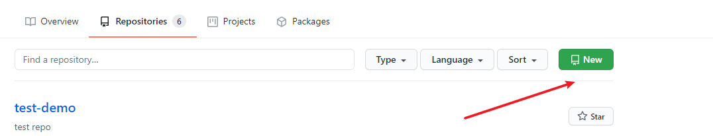 


## 远程仓库初始化

环境：WSL

测试

```bash
➜  git init: 初始化仓库
# 仓库必须有README.md, 否则上传不了
➜  git-demo git:(master) ✗ git add .
➜  git-demo2 git:(master) ✗ git commit -m "first commit"
```

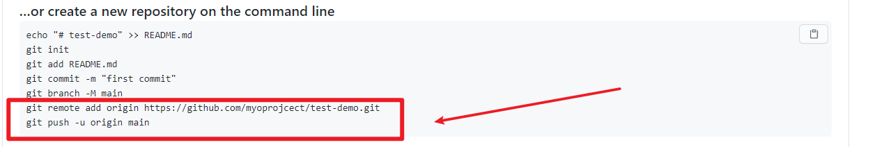 

```bash
➜  git-demo2 git:(master) git branch -M main
➜  git-demo2 git:(main) git remote add origin https://github.com/myoprojcect/test-demo.git


# ➜  git-demo-test git:(main) ✗ git config --global -l //查看git当前设置

# [该报错]: 取消代理
fatal: unable to access 'https://github.com/myoprojcect/test-demo.git/': gnutls_handshake() failed: Error in the pull function.
➜  git-demo2 git:(main) git config --global --unset http.proxy
➜  git-demo2 git:(main) git config --global --unset https.proxy


➜  git-demo2 git:(main) git push -u origin main
```


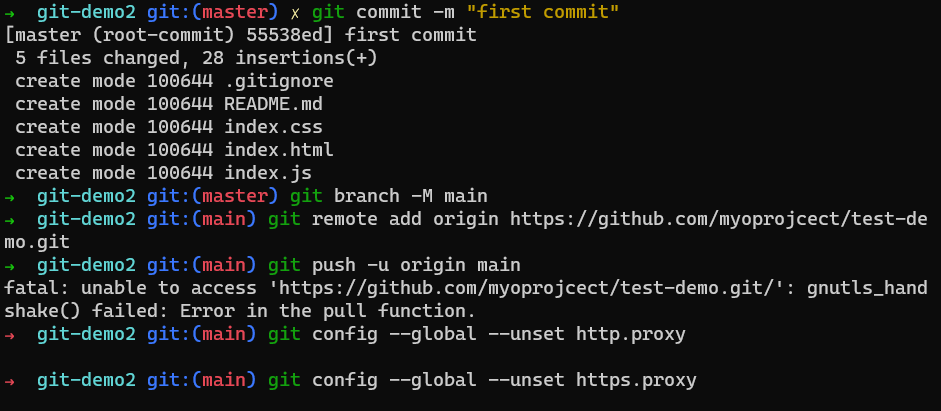 

## 远程仓库创建流程

```bash
git add .
git commit -m 第一次上传文件
git commit -m "first commit"
git branch -M main
# git remote 命用于在远程仓库的操作
git remote add origin https://github.com/myoprojcect/test-demo.git

git config --global --unset http.proxy
git config --global --unset https.proxy

git push -u origin main
```

## 推送到远程仓库

```bash
git add .
# git status 查看一下暂存区状态
# git log 查看一下提交状态
git commit -m "已修改文件"
# git status 查看一下暂存区状态
# git push 推送到远程仓库【这里是main分支】
git push origin main
```

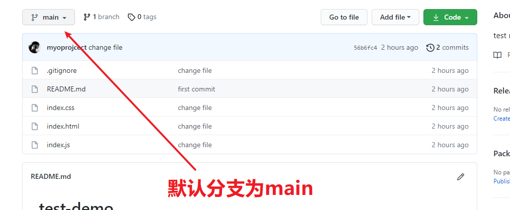 

提交后`git push origin main`

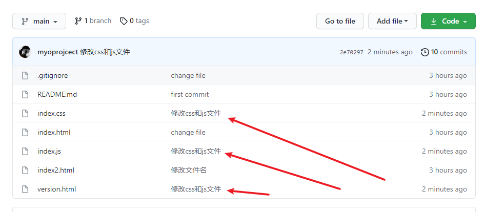 

# 文件管理

## 查看记录

```bash
# 查看项目改动状态
git status
```

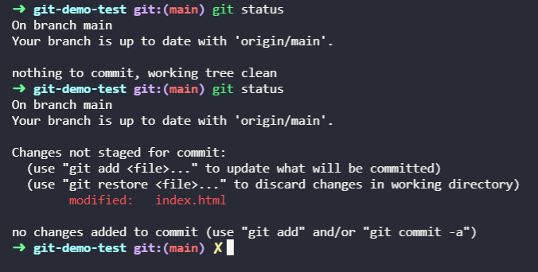 

```bash
# 查看记录
git log
# 查看某个人的提交记录
git log --author="xxx"
# 测试改动
git add .
git commit -m "测试改动
```

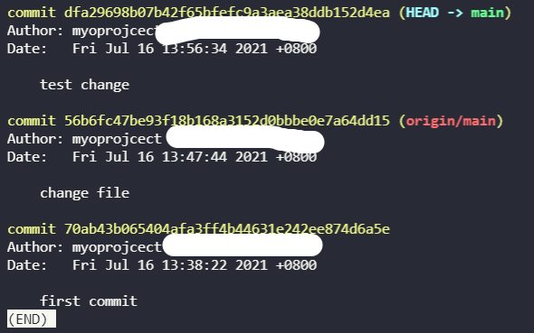 


## 配置用户

```bash
git config --global user.name 'xxx'
git config --global user.email 'xxx@qq.com'

git config --global --list
```

## 修改文件/添加文件

```bash
# 查看项目改动状态
git status

# git add 写入暂存区
git add index.html
git status # 变绿

# git commit 命令将暂存区内容 -> 本地仓库中
git commit -m "change file"

# git push 推送到远程仓库
git push
```

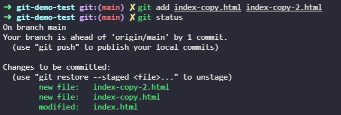 


## 删除文件

1、手动删除文件 -> 删除后重新commit

2、命令行删除

```bash
git rm index.html
```

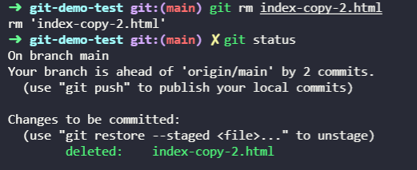 

```bash
git add .
git commit # 重新提交
```

## 重命名文件

1、手动修改（等于一个rm和一个add）

2、命令行重命名

```bash
➜  git-demo-test git:(main) git mv index-copy.html index2.html
```

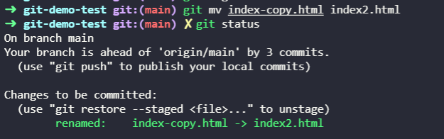 

## 移动文件（同重命名）

### 移动

```bash
➜  git-demo-test git:(main) git mv index-copy.html forder
```

### 移动并重命名

```
➜  git-demo-test git:(main) git mv index-copy.html forder/index.html
```

## 查看文件前后变化

### 通过ID查看

```bash
➜  git-demo-test git:(main) git log --pretty=oneline index.html

# 得到ID
1d652aa1045334d83626cdeb5358a329d66770fa change file
dfa29698b07b42f65bfefc9a3aea38ddb152d4ea test change
56b6fc47be93f18b168a3152d0bbbe0e7a64dd15 (origin/main) change file

➜  git-demo-test git:(main) git show dfa29698b07b42f65bfefc9a3aea38ddb152d4ea[commmit_id]
```

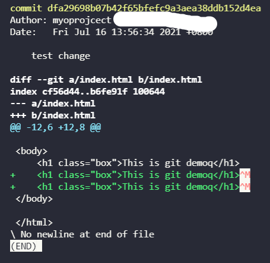 

### 一次性查看

```bash
git log -p index.html

# 翻半页命令为：
# Ctrl + d 键 （d 的英文全拼为：down）
# Ctrl + u 键 （u 的英文全拼为：up）
```

# 提交/回退/版本管理

## 回到最后一次提交状态（未加入暂存区）

未进行commit && 未加入暂存区（未add）

```bash
➜  git-demo-test git:(main) git status
	.......
	
        modified:   index.html

	......

# 这里进行还原到最后一次提交状态
➜  git-demo-test git:(main) ✗ git checkout -- index.html
```

## 回到最后一次提交状态（已加入暂存区）

未进行commit &&  加入暂存区（已add: git已进行文件追踪）

**这时的git已经进行文件追踪了**

```bash
➜  git-demo-test git:(main) git add index.html
# 无效了，git已进行文件追踪
➜  git-demo-test git:(main) ✗ git checkout -- index.html


# 此时git将文件移出暂存区
➜  git-demo-test git:(main) ✗ git reset HEAD index.html
Unstaged changes after reset:
M       index.html
# OK了 -> 这里进行还原到最后一次提交状态
➜  git-demo-test git:(main) ✗ git checkout -- index.html 
```

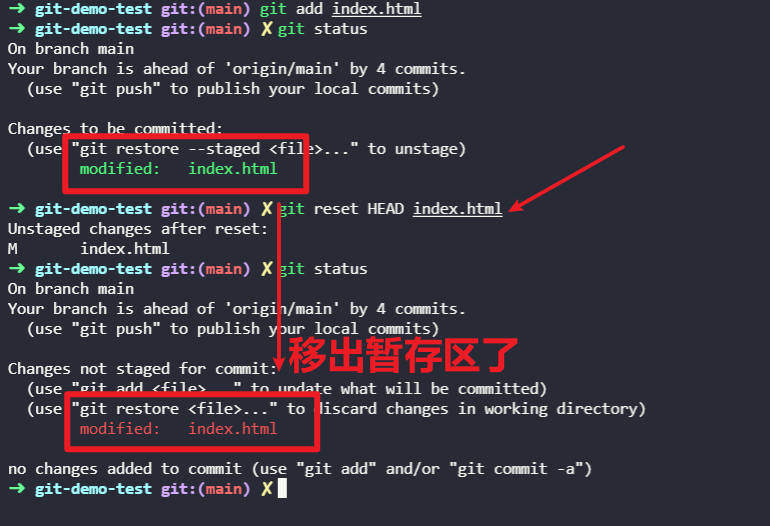 

## 回到项目的上一个版本/指定版本【版本回退】

已进行commit

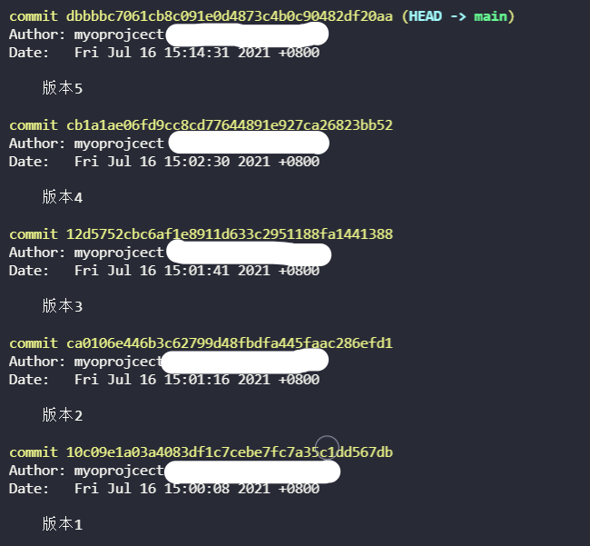 

## 回退到上一个版本

```bash
# 回到上一个版本 【^: 一个^代表回退一个】
➜  git-demo-test git:(main) git reset --hard HEAD^
```

 

## 回退到指定版本

```bash
# 回到指定版本 【git reset --hard commit_id】
➜  git-demo-test git:(main) git reset --hard 10c09e
HEAD is now at 10c09e1 版本1
```

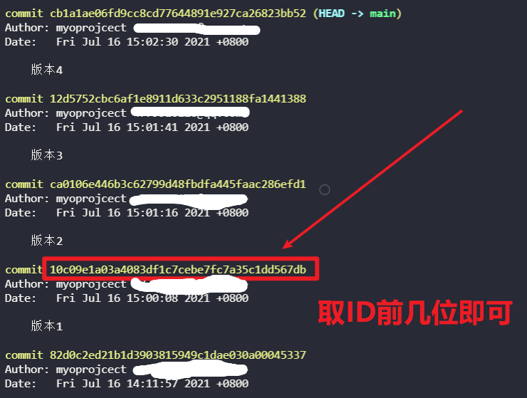  

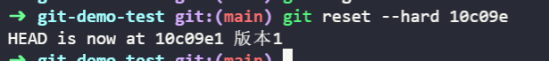 

## 将<u>某一个文件</u>回退到指定版本

将文件index.html回到版本1的状态

```bash
# 指定版本1的ID: 10c09e1[commit_id]
git checkout 10c09e1 -- index.html 

# 然后进行commit
git add index.html
git commit -m "回到到版本1的文件" 
```

## <u>重新</u>回退到（最）新的版本

如之前有5个version，现在回退到了version 1，怎么查重新回到version 5呢 ——`git reset --hard commit_id`

如何找到最新版本的的commit id呢  ——— `git reflog`，该命令按照之前经过的所有的commit路径按序来排列，用来记录你的每一次命令。

 ```bash
git reflog
 ```

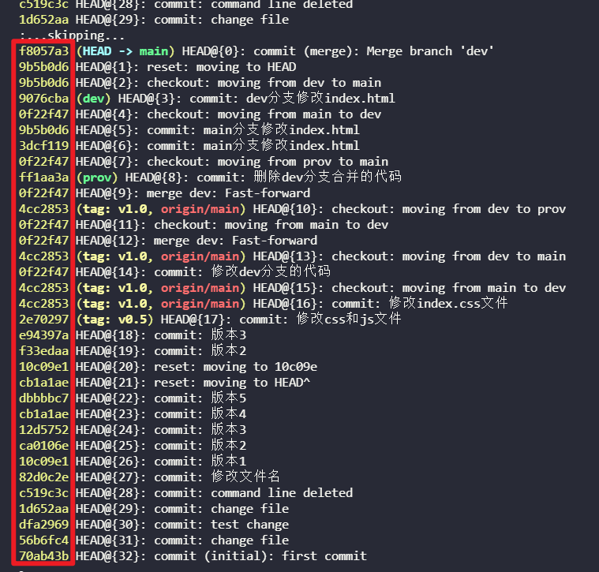 

依旧是：` git reset --hard commit_id[回退整个commit]/ git checkout commit_id -- index.html[回退某个文件]`

## 创建（版本）标签管理

### 为最新一次commit添加tag

```bash
# 添加标签
git tag v1.0
# 查看当前标签
git tag
```

```bash
git log # 查看
# 默认添加在最新的commit上面
commit 4cc2853cc6f4b908bed42c77f07c31ae08c47ac1 (HEAD -> main, tag: v1.0, origin/main)
Author: myoprojcect <xxx@xxx.com>
Date:   Fri Jul 16 19:35:34 2021 +0800
```

### 为之前的某一次commit添加tag

```bash
git tag v0.5 2e702[想要添加commit的commit_id]
```

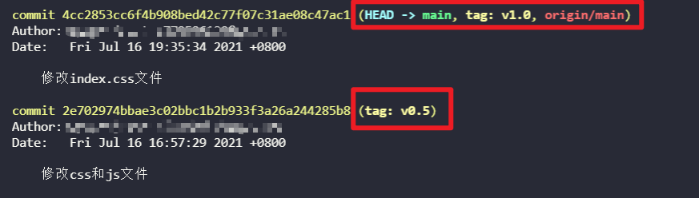 

### 删除tag

```bash
git tag v0.5
```

### 推送到远程仓库

```bash
git push origin v1.0
```

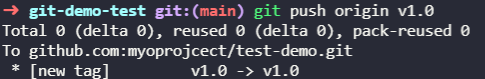 

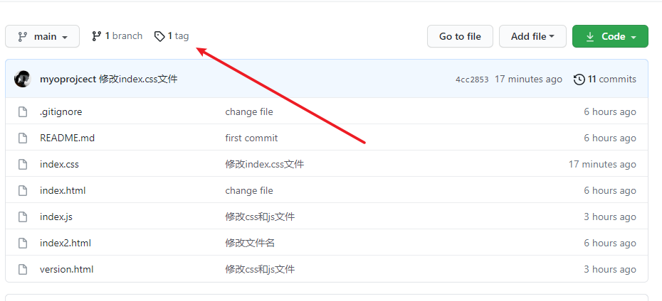 

# 分支管理

## 创建分支

```bash
# 创建两个分支，一个dev，一个prov
git branch dev
git branch prov
```

**创建分支实际上会从主线分支里面拷贝了一份，所以<u>main分支</u>commit的内容会完整复制到<u>dev分支</u>上面**

## 查看当前分支

```bash
git branch
```

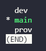 

## 切换分支

```bash
git checkout dev
```

## 删除分支

1、删除分支（不能删除当前分支/已commit的分支）

```bash
git checkout -d dev
```

2、强制删除分支

```bash
git checkout -D dev
```

## 创建并切换分支

```bash
git branch -b prov
```

## 合并分支

```bash
➜  git-demo-test git:(dev) git status

        modified:   index.html

➜  git-demo-test git:(dev) ✗ git add .        
➜  git-demo-test git:(dev) ✗ git commit -m 修改dev分支的代码
[dev 0f22f47] 修改dev分支的代码
 1 file changed, 1 insertion(+)
 
# 切换回主分支
git checkout main
# 将dev合并到主分支
git merge dev
```

## 分支冲突

两个分支同时对同一个文件进行修改，并完成了commit  ——> 合并时将导致冲突

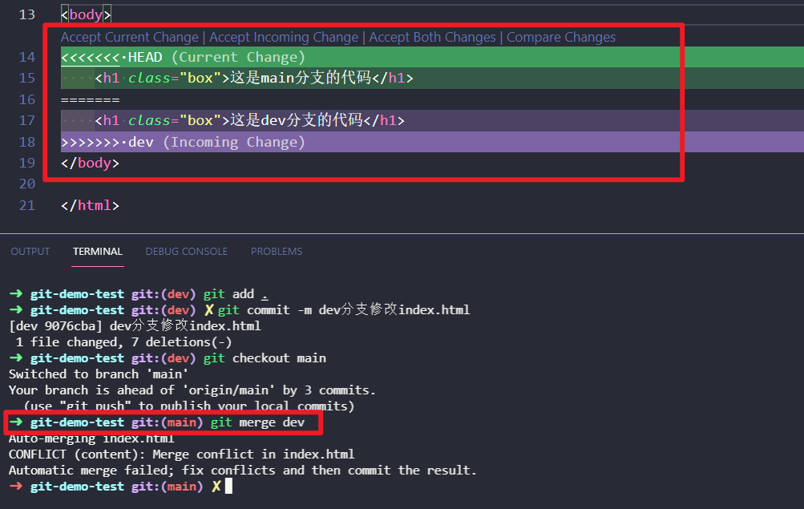 

1、保留当前分支

```bash
git merge dev

# 忽略dev分支代码，保留当前main分支的代码
git merge --abort
```

2、手动删除

手动删除，留下需要的内容，然后进行两次commit: 第一次是为了说明，第二次是正式commit

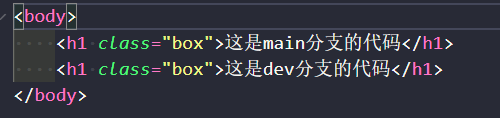 

```bash
git merge dev

# 忽略dev分支代码，保留当前main分支的代码
git merge --abort

git add .
git commit # -->弹出一个可编辑文件，在里面说明怎么处理这两个冲突的分支
git commit -m 解决冲突之后的代码
```


# SSH免密登录

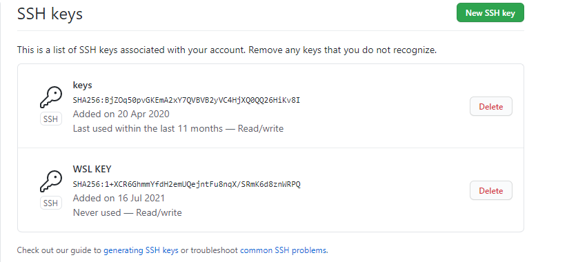 


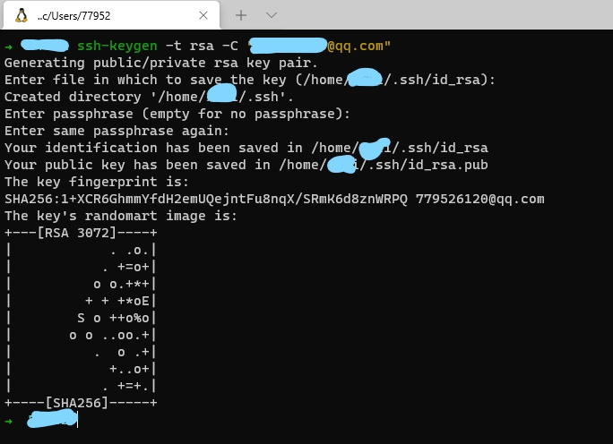   

https://blog.csdn.net/Alice_qixin/article/details/97135719

https://blog.csdn.net/qq_41563601/article/details/105467023

# 补充说明

## 1、学习参考

https://www.bilibili.com/video/BV1ka411w7Dd?p=26

Git版本切换：https://www.jianshu.com/p/cf3102d44ad3

注：P22-P25未看：多人协作管理代码

## 2、配置git默认编辑器为vim

```bash
git config --global core.editor "vim"
```

`cd -: 回到上一次的目录`

## 3、在github.com后面添加1s可以变成在线查看工具

eg：https://github1s.com/myoprojcect/test-demo/blob/HEAD/index2.html

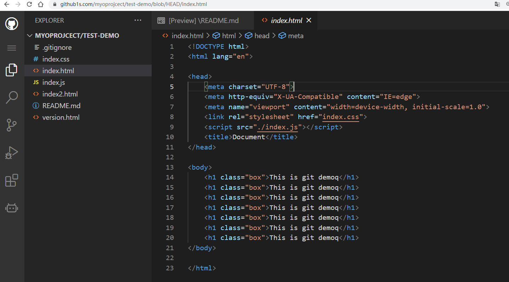 

## 4、插件

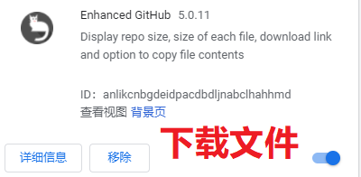 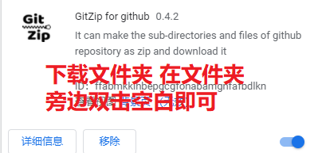 

## 5、【尝试】将git笔记上传上去

1、创建仓库

  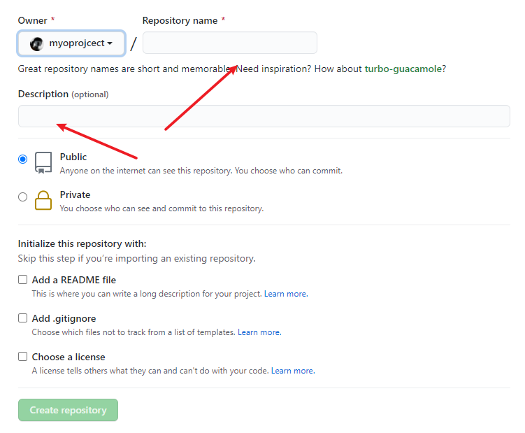 

2、将文件夹提交上去

```bash
 echo "# study-notes" >> README.md
 git init
 git add .
 git status
 git commit -m "git相关笔记"
 git branch -M main
 git remote add origin git@github.com:myoprojcect/study-notes.git
 git push -u origin main
```

## 6、github的md文件目录

github上如何为markdown文件生成目录：https://blog.csdn.net/johnjim0/article/details/105353427