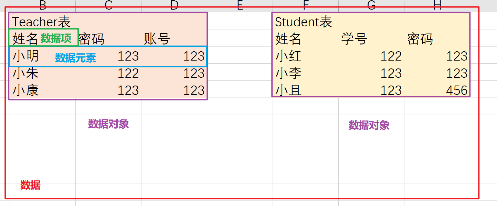
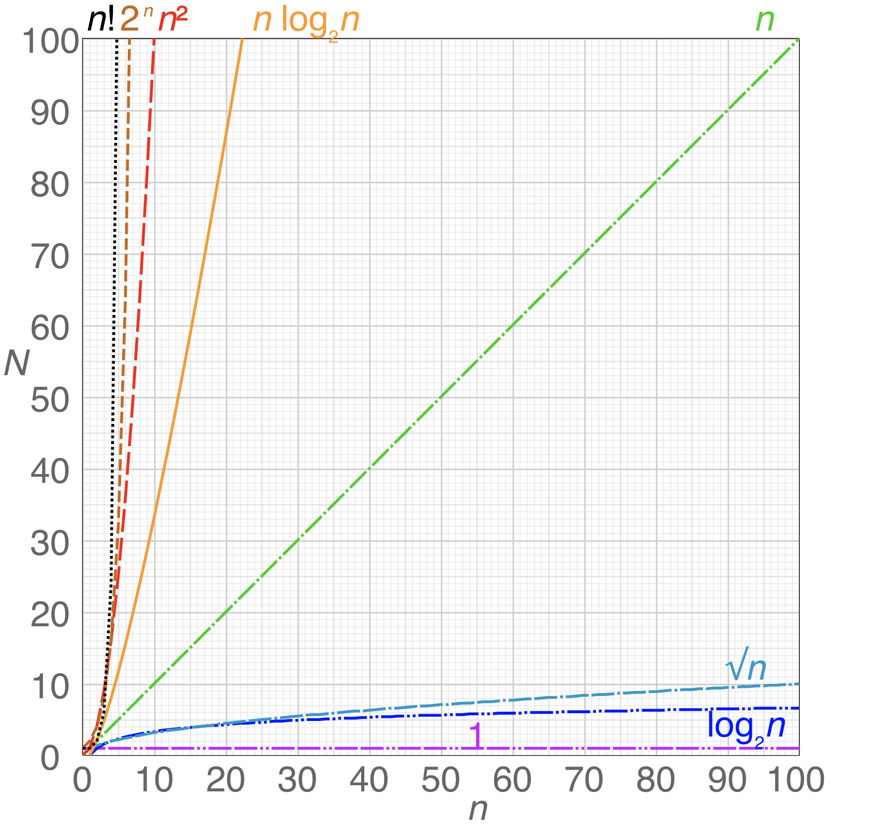
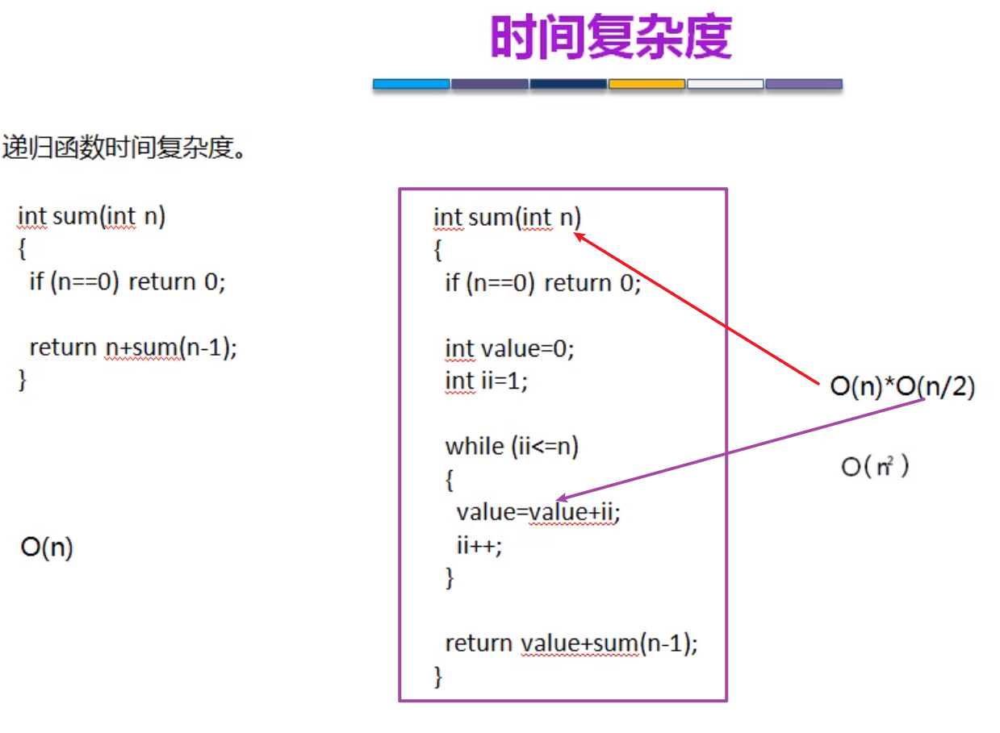
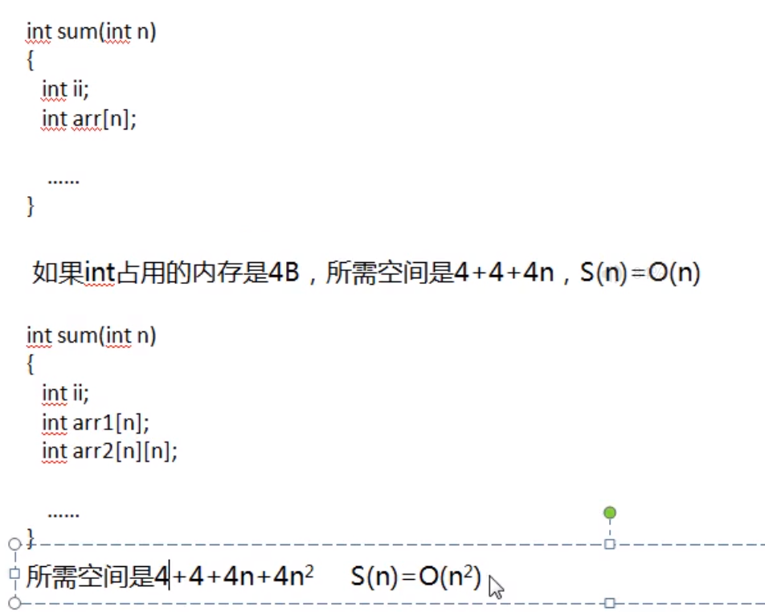
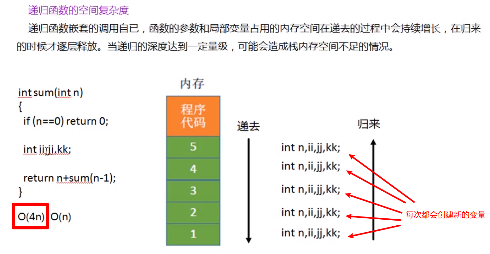
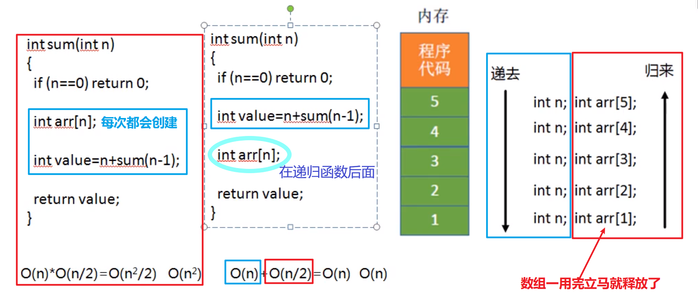

## 专业术语

> 数据：能输入到计算机并被计算机处理的符号总称
>
> > 数据元素：数据的**基本单位**
> >
> > > 数据项：数据元素的**最小单位**
>
> 数据对象：**性质相同**的一系列**数据元素**（eg: 一个Student、Employee对象）
>
> 数据类型：一个值的集合（eg: Integer、String等等）

> 抽象数据类型（ADT）的组成:
>
> > 数据对象
> >
> > 数据关系
> >
> > 基本操作

 

## 数据结构

> 数据结构
>
> >**逻辑结构**
> >
> >> 数据元素之间的逻辑关系
> >>
> >> 分为四种类型（CLTG）
> >>
> >> > 集合类型
> >> >
> >> > 线性结构（一对一关系）
> >> >
> >> > 树形结构（一对多关系）
> >> >
> >> > 图结构/网状结构（多对多关系）
> >> >
> >> > Connection、Linear、Tree、Graph
> >
> >**存储结构（物理结构）**
> >
> >> 分为四种存储
> >>
> >> > 顺序存储（eg：数组）
> >> >
> >> > 链式存储（eg： LinkedList）
> >> >
> >> > 索引存储（eg： B+树）
> >> >
> >> > 哈希存储（eg： HashSet）
> >
> >**运算**
> >
> >> 在数据的逻辑结构上定义操作：如增删查改

## 算法的五个重要特性

“出入确可穷”：输出、输入、确定性（每条指令有确切含义）、可行性、有穷性（指令有穷，且时间有限）

## 算法设计要求

“正确快读健节（见接）”：正确性、快速性（时间上）、可读性、健壮性、节省性（空间上）

## 时间复杂度

时间复杂度：算法在计算机执行的过程中所需要运行的时间

时间复杂度关心的是数量级，所以对f(n)函数表达式要简化,原则是: 1、略去常数``O(n+1) => O(n)``  2、只保留最高阶的项 `O(3n^3+500n^2+300n) => O(n^3)`3、变最高阶项的系数为1`O(5n) = O(n)`

**一般情况下只关系程序中内层循环即可**

**时间复杂度曲线**

 

递归计算

 

在实际开发还是要进行测试才能得到真实结果

## 空间复杂度

空间复杂度：算法在计算机执行的过程中所需要的存储空间大小

使用**数组**或者是**递归**可能会使得空间复杂度上升

 

递归计算

例子一

 

例子二：

 

## 学习参考

https://blog.csdn.net/qq_40627648/article/details/86744358 

b站c语言技术网：https://www.bilibili.com/video/BV1oN411Q7Yz?p=16