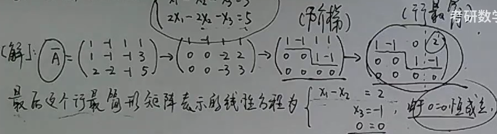
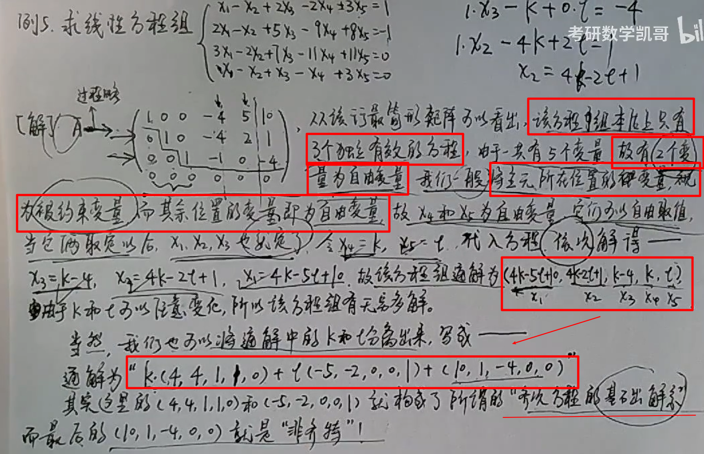
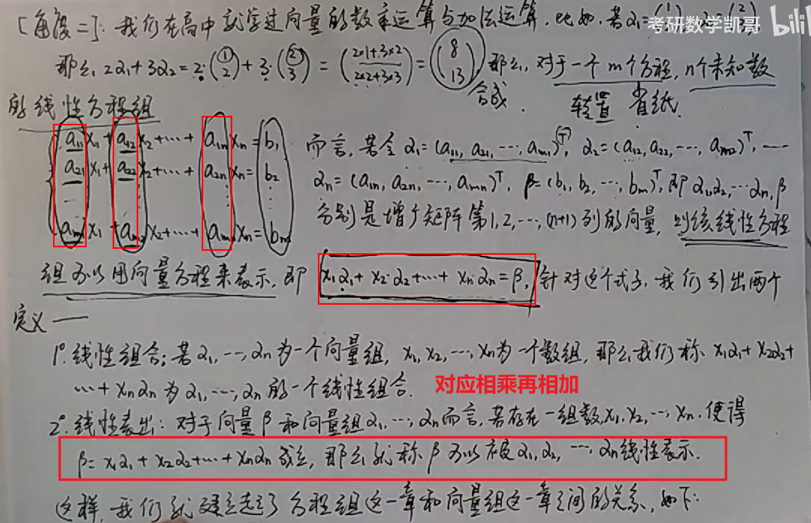
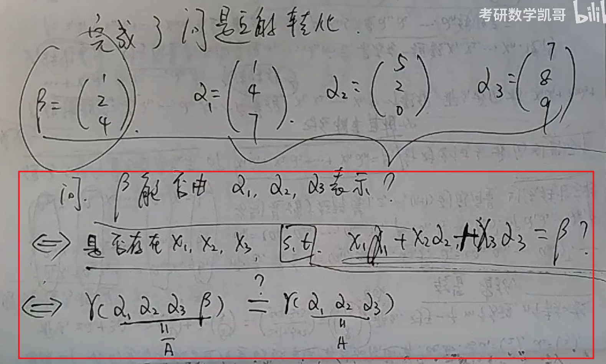
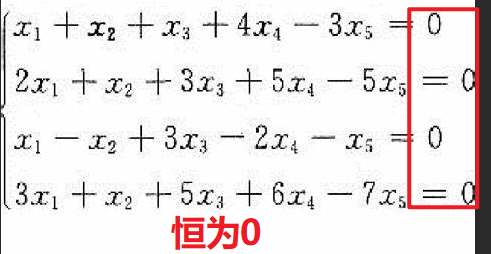

https://www.latexlive.com/

## 概述

研究线性空间和线性映射——考研只考**线性空间与线性映射**

考研的重点

- **行列式、矩阵、向量组**为工具——研究**线性方程组的解法和解的结构**
- **特征值、特征向量**为工具——研究**矩阵相似，及二次型的标准型问题**

## 线性方程组

多元线性方程组n

 

为了方便计算，进行变量统一 

    

**以前的方法：消元（过于复杂）—— 目标是找到一个通解且方便的方法进行计算**

## 核心问题

**1、线性方程组是否一定有解**

**2、有解的话有几个解**

**3、如何求解**

**4、有多个解的话，解之间有什么关系**

## 线性方程组到矩阵理论 

### 高斯消元法

**通过一个一个未知量的消除进行一次次的变换，即消去x1、再消去x2最终得到x3，通过减少未知数的个数来求解方程**

**从上往下计算——到阶梯型——再从下往上计算**

 

 

### 三大初等变换

恒等变形、同解变形

- 方程组的两个方程互换位置
- 由一个非零的数乘上某个方程
- 加一个方程加到另一个方程上面 

## 高斯消元到矩阵的概念

### 矩阵的引入

高斯消元只是普通的代入系统数的运算，未知数只是照抄而已——将系数和常数单独拿出来，按照原有的方式排成一张表，那么这张表即为增广矩阵（不写最后一列常数项【即只看系数】则为**系数矩阵**）

  

### 再次求解方程——初等行变换的引入

### 三大初等行变换

 

- 互换两行的位置
- 用一个非零数乘上某一行
- 用一行的倍数加到另外一行上

###  阶梯型矩阵（不唯一）

若矩阵满足两个特点

- 零行全在下方
- 每一个非零行的**第一个不为0的元素称为主元**，**主元的列指标**随着**行指标增大**而**严格增大**
- <u>**即矩阵的高度只能为1，但是平台长度（横向）可以不唯一**</u>

则为阶梯型矩阵

 

### 行最简矩阵（唯一）

满足三个特点

- 阶梯型矩阵
- 非零行的主元全为1
- 每个主元所在的列的其余元素全是0

 

**行最简矩阵则是最简单的阶梯型矩阵**

**如何化简：从从上往下计算——到阶梯型矩阵——再从下往上计算——到行最简矩阵**

### 例题1（无解）

 

得出什么结论？

线性方程组不一定有解，是可能无解的

方程组之所以无解，是因为经过初等行变化到阶梯型矩阵时，很不巧**<u>最后一行的主元竟然在最后一列</u>**！—— 导致“0 = d”这样类似的方程出现，从而导致方程组无解

### 例题2（无数解）

 

该方程组本质上只有两个独立方程（两个约束），但是有三个未知数——必定有一个是自由变量，自由变量不受约束，可以自由取值

这里假设x2为自由变量，不妨假设x2=k（k的值可以任意取，故实际上x1与x2有无限多种情况），即三个个未知数分别：x1=2+k；x2=k，x3=-1

该方程的解为（k+2，k，-1），可以看出k变则解就变，该解也称为方程的**通解**

可以将其分解为【含有任意常数k的部分与不含k的部分】

即解为（k+2,k,-1）

 

故线性方程组可以有无限解——**变量中存在自由变量，故方程有无数个特解**

### 例题3（多个自由变量）

3个独立方程、5个变量：将主元所在的位置作为被约束的变量，其余作为自由变量——可以得到线性方程的通解

 

**方程个数 < 变量个数 - 2 ，即变量中可以存在多个自由变量**

### 总结

有的方程可能矛盾，有的方程可能多余，故并不是几个未知数就需要几个方程

不管是高斯消元法还是初等行变换，其**核心都是消去多余的方程，保留真正有价值的方程**

增广矩阵化为阶梯型（尤其是行最简）

- 所有非零行方程才是真正有用的方程
- 非零行的最后一行中，若主元存在最后一列，那么方程将无解（0 = d）；若主元不在最后一列，那方程必定有解
- 有解的条件下
  - 唯一解或无穷多解 取决于非零行的行数（约束个数）与未知数个数（变量个数）的关系
    - 非零行行数 = 未知数个数：唯一解
    - 非零行行数 < 未知数个数（约束的少于变量，约束不了他们了——存在自由变量）：无穷多解

### 总结框图

 

## 矩阵的秩

矩阵的秩：**阶梯型矩阵非零行的个数**

 

故有

 

 

## 线性方程组到向量

### 线性方程组到向量组

 

### 将线性方程组转换为列向量的计算

转秩：行变列，列变行

 

 

 

 

## 齐次方程的线性相关与线性无关

### 齐次方程

 

### 非齐次方程

  

  

### 齐次方程与普通方程

 

### 线性相关与线性无关

 

 

证明

 

 

## 学习参考

考研数学凯哥：https://www.bilibili.com/video/BV1e54y1m7TC